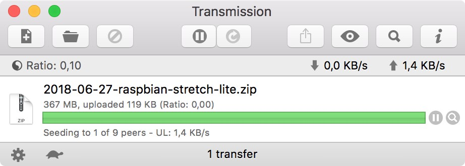
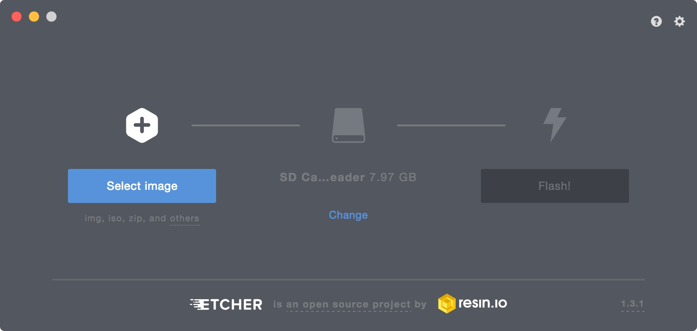
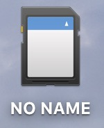

First of all we need to install OS on our micro computer -- Raspberry Pi.

So I download an image from [https://www.raspberrypi.org/downloads/raspbian/](https://www.raspberrypi.org/downloads/raspbian/) with Transmission torrent application:

Then we need to unzip this file and we receive `.img` file.

Using the Etcher app and with micro sd card inserted I will write the image of OS onto sd card.

After the process has been completed I removed the card and inserted it into the Raspberry Pi. You need a keyboard and a monitor connected to initially set up Raspberry Pi.

After the set up I will connect to it with `ssh`.

To login for the first time you need to fill "pi" as `username` and "raspberry" as `password`.

### Setting Wi-Fi connection:

1. `sudo raspi-config`
2. "2. Network Options"
3. "N2. Wi-fi"
4. Choose your country
5. Enter the SSID (name) of your network
6. Enter the passphrase (password)
7. Press "Finish" button

Now your Raspberry Pi is connected to Wi-Fi. It can be checked with `ping google.com` -- 0% packet loss.

### SSH

1. `sudo raspi-config`
2. "5. Interfacing Options"
3. "P2. SSH"
4. "Yes"
5. "Ok"
6. Press "Finish" button

### Movidius

`sudo apt-get install git`

`Y`
